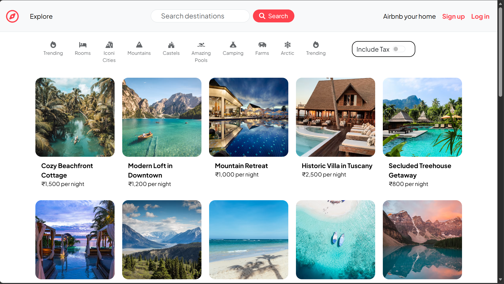
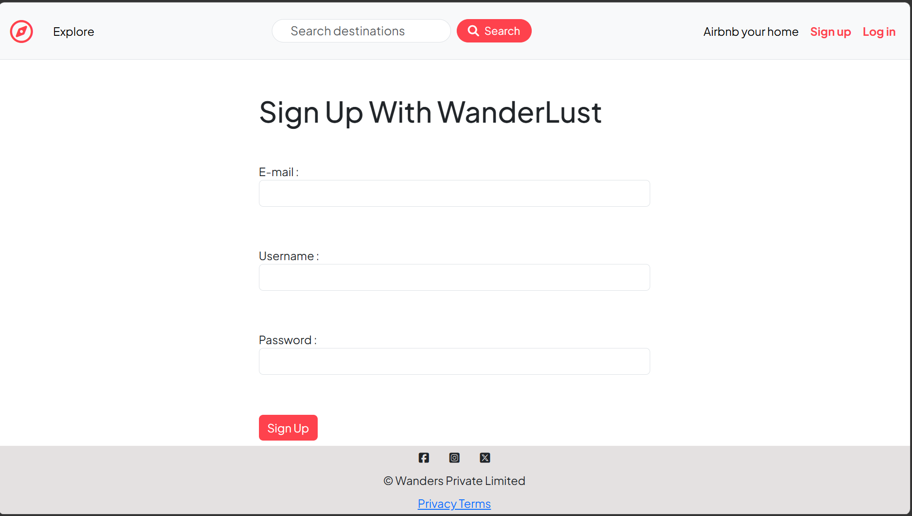
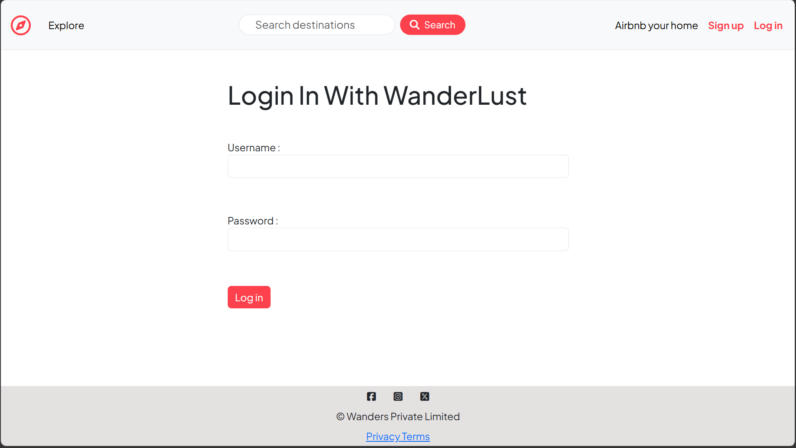
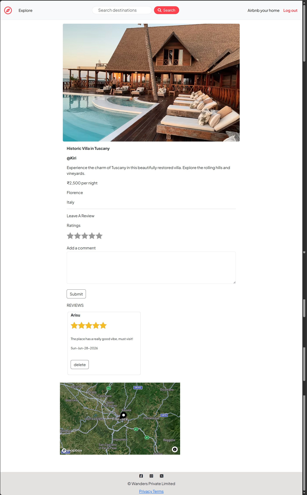
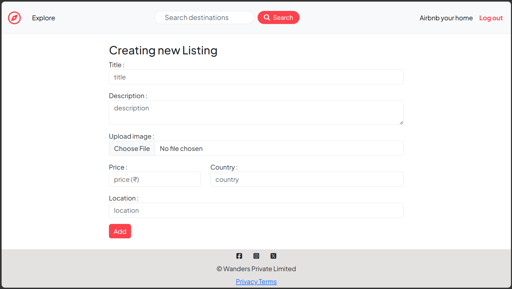
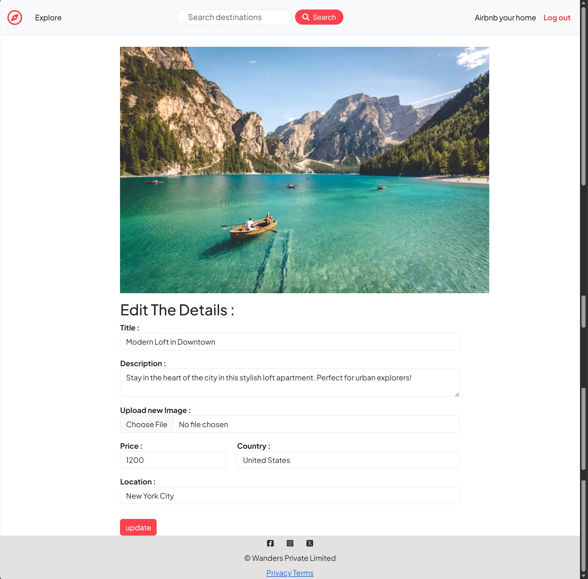
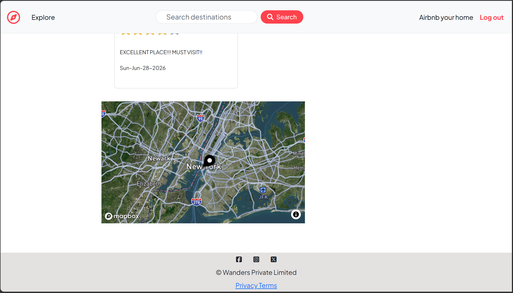

<div align="center">

# 🏡 WanderLust

### A Full-Stack Airbnb Clone Built with Node.js, Express & MongoDB

An Airbnb-inspired web application where users can discover unique stays, create and manage property listings, upload images, explore locations on interactive maps, and share their experiences through reviews.


⭐ If you found this project interesting, consider giving it a star!

</div>

---

# 🌐 Live Demo

| Application | Link |
|------------|------|
| 🏡 WanderLust | **https://wander-lust-9dhb.onrender.com** |

---

# 📸 Screenshots

## 🏠 Home Page

> 

---

## 📝 Sign Up

> 

---

## 🔐 Login

> 

---

## 🏡 Listing Details

> 

---

## ➕ Create Listing

> 

---

## ✏️ Edit Listing

> 

---

## 🗺️ Interactive Map

> 

---

# 📖 About the Project

**WanderLust** is a full-stack Airbnb-inspired web application developed to simulate a real-world vacation rental platform.

Users can browse listings, create and manage their own properties, upload high-quality images, locate destinations using interactive maps, and leave reviews on listings.

The project focuses on implementing industry-standard backend concepts including authentication, authorization, RESTful APIs, cloud-based image storage, session management, MVC architecture, and secure route protection.

---

# ✨ Features

## 👤 Authentication

- User Registration
- Secure Login & Logout
- Passport.js Authentication
- Password Encryption
- Session Management
- Protected Routes

---

## 🏡 Property Listings

- Browse All Listings
- View Listing Details
- Create New Listings
- Edit Existing Listings
- Delete Listings
- Ownership Verification

---

## 📸 Image Management

- Upload Property Images
- Cloudinary Integration
- Optimized Cloud Image Storage

---

## ⭐ Reviews & Ratings

- Add Reviews
- Delete Reviews
- Rating System
- User Authorization for Reviews

---

## 🗺️ Maps & Location

- Interactive Maps
- Automatic Geocoding
- Display Property Location
- Mapbox Integration

---

## 🛡️ Security

- Server-side Validation
- Authentication Middleware
- Authorization Checks
- Flash Messages
- Secure Sessions
- Environment Variables

---

# 🏗 Project Architecture

```text
               Client (Browser)
                      │
                      ▼
             Express.js Server
                      │
      ┌───────────────┼───────────────┐
      │               │               │
      ▼               ▼               ▼
 Authentication   Cloudinary      Mapbox API
      │
      ▼
 MongoDB Database
```

---

# 🛠 Tech Stack

### Frontend

* HTML5
* CSS3
* Bootstrap
* JavaScript
* EJS Templates

### Backend

* Node.js
* Express.js
* Passport.js
* Express Session
* REST APIs

### Database

* MongoDB
* Mongoose

### Cloud Services

* Cloudinary
* Mapbox Geocoding API

### Deployment

* Render

---

# 📂 Project Structure

```text
WanderLust
│
├── controllers/
├── init/
├── models/
├── public/
├── routes/
├── utils/
├── views/
├── middleware.js
├── cloudConfig.js
├── schema.js
├── app.js
├── package.json
└── README.md
```

---

# 🚀 Installation

Clone the repository

```bash
git clone https://github.com/anokhi-soni/Wander-Lust
```

Move into the project directory

```bash
cd WanderLust
```

Install dependencies

```bash
npm install
```

---

# ▶️ Running the Project

Start the server

```bash
nodemon index.js
```

Visit

```text
http://localhost:8080
```

---

# 🔑 Environment Variables

Create a `.env` file and add the following:

```env
ATLASDB_URL=YOUR_MONGODB_CONNECTION_STRING

SECRET=YOUR_SECRET_KEY

CLOUD_NAME=YOUR_CLOUDINARY_CLOUD_NAME

CLOUD_API_KEY=YOUR_CLOUDINARY_API_KEY

CLOUD_API_SECRET=YOUR_CLOUDINARY_API_SECRET

MAP_TOKEN=YOUR_MAPBOX_ACCESS_TOKEN
```

---

# 📚 What I Learned

Developing this project helped me strengthen my understanding of:

* MVC Architecture
* RESTful API Design
* Authentication & Authorization
* Passport.js
* Express Sessions
* MongoDB Relationships
* CRUD Operations
* Middleware
* Cloudinary Image Upload
* Mapbox Geocoding API
* Server-side Validation
* Error Handling
* Deployment using Render
* Git & GitHub Workflow

---

# 🚀 Future Enhancements

* ❤️ Wishlist / Favorites
* 📅 Booking System
* 💳 Payment Gateway Integration
* 🔍 Advanced Search Filters
* 💬 Real-time Chat
* 🔔 Notifications
* 📱 Progressive Web App (PWA)
* 🌍 Multi-language Support

---

# 🤝 Contributing

Contributions are welcome!

If you have suggestions or improvements, feel free to fork the repository and submit a pull request.

---

# 👨‍💻 Developer

**Anokhi Soni**

Full Stack MERN Developer

---

<div align="center">

## ⭐ Thank you for visiting this repository!

If you enjoyed exploring this project, please consider leaving a ⭐.

Made with ❤️ using Node.js, Express, MongoDB & Bootstrap.

</div>
